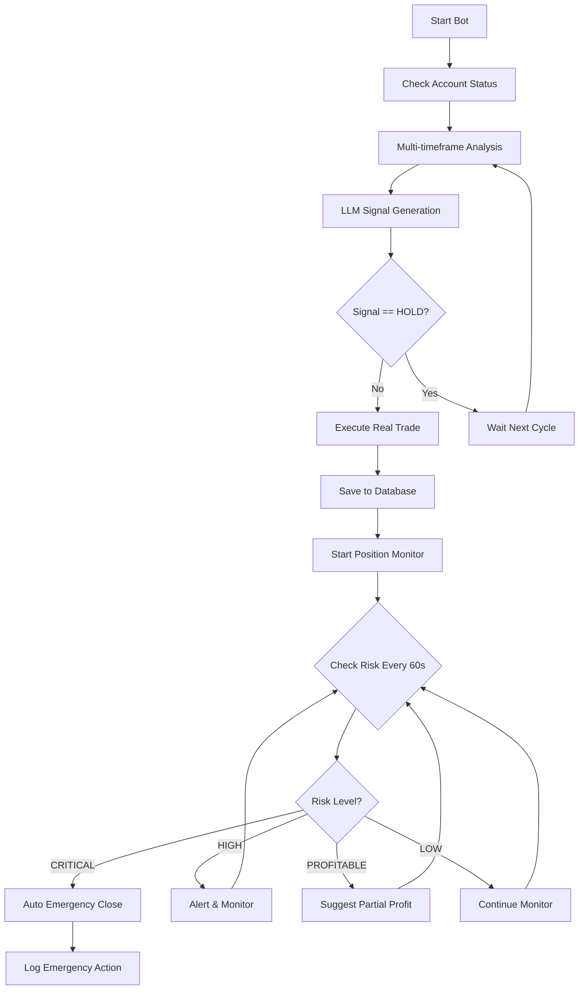

# 🤖 TRADING SYSTEM OVERVIEW

## ✅ **TRẠNG THÁI HỆ THỐNG**

### 🔧 **1. BOT ĐÃ ĐƯỢC SỬA ĐỂ VÀO LỆNH THẬT**

**File đã sửa**: `bot_files/binance_futures_bot.py`

**Thay đổi chính**:
- ❌ **Trước**: `execute_trade()` - chỉ simulation 
- ✅ **Sau**: `setup_position()` - vào lệnh thật trên Binance
- ✅ Thêm `check_account_status()` - kiểm tra tài khoản
- ✅ Thêm `save_transaction_to_db()` - lưu transaction
- ✅ Thêm confirmation prompt cho safety

**Cách chạy**:
```bash
python bot_files/binance_futures_bot.py
```

---

## 💰 **2. KIỂM TRA TÀI KHOẢN BINANCE**

### **Account Status Check**:
```python
account_status = bot.check_account_status()
```

**Thông tin hiển thị**:
- 💰 Available Balance: $XXX USDT  
- 💎 Total Wallet Balance: $XXX USDT
- 📊 Open Positions: X positions
- 📈 Chi tiết từng position (PnL, entry price, risk level)

### **Sample Output**:
```
💼 CHECKING BINANCE ACCOUNT STATUS...
🧪 TESTNET Account Balance:
   💰 Available: $1,000.00 USDT
   💎 Total Wallet: $1,000.00 USDT

📊 Open Positions: 1
   📈 BTCUSDT: LONG 0.005 @ $50,000.00
      💵 PnL: +$125.00 (+2.5%)
```

---

## 💾 **3. TRANSACTION LOGGING**

### **A. Local JSON Storage** (Fallback)
**File**: `futures_transactions.json`
```json
{
  "timestamp": "2025-01-03T10:30:00",
  "action": "BUY", 
  "symbol": "BTCUSDT",
  "quantity": "0.005",
  "entry_price": 50000.0,
  "order_id": "12345678",
  "stop_loss": {"price": 49000.0},
  "take_profit": {"price": 52000.0}
}
```

### **B. Database Storage** (Production)
**Tables được sử dụng**:
- `trades` - Lưu chi tiết trade
- `performance_logs` - Log mọi action
- `subscriptions` - Quản lý bot subscriptions

**Code example**:
```python
# Lưu trade vào database
trade_data = schemas.TradeCreate(
    subscription_id=subscription_id,
    side=trade_result.get('action'),
    entry_price=float(trade_result.get('entry_price')),
    quantity=float(trade_result.get('quantity')),
    stop_loss_price=trade_result.get('stop_loss', {}).get('price'),
    take_profit_price=trade_result.get('take_profit', {}).get('price')
)
db_trade = crud.create_trade(db_session, trade_data)
```

---

## 🔄 **4. MONITORING TỰ ĐỘNG**

### **A. Position Monitor** 
**File**: `position_monitor.py`

**Chức năng**:
- ⏰ Check positions mỗi 60 giây
- 🔴 Auto close khi loss > -5%
- 💚 Gợi ý chốt lời khi profit > 3%
- 📝 Log tất cả emergency actions

**Cách chạy**:
```bash
python position_monitor.py
```

### **B. Celery Task System** (Production)
**File**: `core/tasks.py`

**Tasks tự động**:
- `schedule_active_bots()` - Chạy mỗi 1 phút
- `run_bot_logic()` - Thực thi bot logic  
- `cleanup_old_logs()` - Dọn dẹp logs cũ

**Scheduling**:
- 1m timeframe → check mỗi 1 phút
- 5m timeframe → check mỗi 5 phút  
- 1h timeframe → check mỗi 1 giờ
- 4h timeframe → check mỗi 4 giờ
- 1d timeframe → check mỗi 1 ngày

---

## 🚨 **5. AUTO RISK MANAGEMENT**

### **Risk Levels**:
- 🟢 **LOW**: Position bình thường
- 🟠 **HIGH**: Loss > -2.5%, cần theo dõi
- 🔴 **CRITICAL**: Loss > -5%, auto close ngay lập tức
- 💚 **PROFITABLE**: Profit > 3%, có thể chốt lời

### **Auto Actions**:
1. **EMERGENCY_CLOSE**: Đóng ngay khi loss > -5%
2. **PARTIAL_PROFIT**: Chốt 50% lời khi profit > 3%
3. **MONITOR_CLOSE**: Cảnh báo high risk

### **Emergency Log**:
```json
{
  "timestamp": "2025-01-03T10:30:00",
  "action_type": "EMERGENCY_CLOSE",
  "symbol": "BTCUSDT", 
  "pnl_percentage": -5.2,
  "reason": "Emergency stop: Loss exceeds -5.0%",
  "auto_executed": true
}
```

---

## 🔧 **6. CÁCH SỬ DỤNG HỆ THỐNG**

### **A. Chạy Bot Standalone** (Testing)
```bash
python bot_files/binance_futures_bot.py
```

### **B. Chạy với Database Integration** (Production)
```bash
python demo_real_trading_system.py
```

### **C. Chạy Position Monitor**
```bash
python position_monitor.py
```

### **D. Chạy Full System với Celery** (Production)
```bash
# Terminal 1: Start Redis
redis-server

# Terminal 2: Start Celery Worker  
celery -A utils.celery_app worker --loglevel=info

# Terminal 3: Start Celery Beat (Scheduler)
celery -A utils.celery_app beat --loglevel=info

# Terminal 4: Start API Server
python core/main.py
```

---

## ⚙️ **7. CONFIGURATION**

### **Bot Config**:
```python
config = {
    'trading_pair': 'BTCUSDT',
    'testnet': True,  # False cho LIVE trading
    'leverage': 10,
    'stop_loss_pct': 0.02,  # 2%
    'take_profit_pct': 0.04,  # 4%  
    'position_size_pct': 0.1,  # 10%
    'timeframes': ['5m', '30m', '1h', '4h', '1d'],
    'primary_timeframe': '1h',
    'use_llm_analysis': True,
    'require_confirmation': True  # Safety for testing
}
```

### **Monitor Config**:
```python
monitor_config = {
    'check_interval': 60,  # seconds
    'max_loss_threshold': -0.05,  # -5%
    'profit_take_threshold': 0.03,  # 3%
}
```

---

## 📊 **8. WORKFLOW HOÀN CHỈNH**



---

## ⚠️ **9. SAFETY FEATURES**

### **Testing Mode**:
- ✅ `testnet: true` - Chạy trên Binance Testnet
- ✅ `require_confirmation: true` - Confirm trước khi trade
- ✅ JSON file backup cho transactions

### **Production Mode**:
- ✅ Database transaction logging
- ✅ Email notifications
- ✅ Automatic position monitoring  
- ✅ Emergency stop loss
- ✅ Multi-level risk management

### **Key Safety Checks**:
1. **Account Balance**: Check trước khi trade
2. **Position Size**: Capital management
3. **Stop Loss**: Tự động đặt SL/TP
4. **Risk Monitoring**: Check mỗi 60s
5. **Emergency Close**: Auto close khi loss > -5%

---

## 🎯 **10. NEXT STEPS**

### **Để chạy LIVE Trading**:
1. Thay `testnet: False` trong config
2. Cung cấp API keys LIVE Binance
3. Setup database production  
4. Configure email notifications
5. Deploy monitoring system

### **Để scale system**:
1. Setup Kubernetes deployment (đã có trong `/k8s/`)
2. Configure Redis cluster
3. Setup monitoring dashboard
4. Add more trading pairs
5. Implement portfolio management

---

## 📞 **SUPPORT**

Tất cả các file đã được cập nhật và ready để chạy:
- ✅ `bot_files/binance_futures_bot.py` - Main bot với real trading
- ✅ `position_monitor.py` - Auto monitoring system  
- ✅ `demo_real_trading_system.py` - Full system demo
- ✅ Database schema already exists
- ✅ Celery tasks ready for production

**Chạy ngay**: `python bot_files/binance_futures_bot.py`