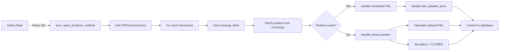

# Real-Time Position Sync System

## 📊 Overview

Comprehensive real-time position synchronization system that keeps transaction records in sync with exchange APIs.

## ✨ Features

### 1. **Multi-Exchange Support**
- ✅ Bybit
- ✅ Binance
- ✅ OKX
- ✅ Bitget
- ✅ Huobi
- ✅ Kraken

### 2. **Real-Time Updates**
- **Unrealized P&L**: Calculated every 10 seconds
- **Current Price**: Fetched from exchange mark price
- **Position Status**: Auto-detect closed positions
- **Exit Information**: Auto-populate exit_price, exit_time, exit_reason

### 3. **Auto-Close Detection**
When a position is closed on exchange but still marked as OPEN in database:
- ✅ Fetch position from exchange
- ✅ Calculate realized P&L
- ✅ Determine exit reason (TP_HIT, SL_HIT, MANUAL)
- ✅ Update transaction status to CLOSED
- ✅ Trigger performance metrics update

---

## 🏗️ Architecture

### Components

#### 1. **Position Sync Service** (`services/position_sync_service.py`)
Core service that handles:
- Exchange API communication
- Transaction updates
- P&L calculations
- Auto-close detection

```python
class PositionSyncService:
    def sync_all_open_positions() -> Dict[str, Any]
    def sync_transaction_with_exchange(transaction) -> Dict[str, Any]
    def _update_open_position(transaction, position) -> Dict[str, Any]
    def _handle_closed_position(transaction, exchange_client) -> Dict[str, Any]
```

#### 2. **Celery Task** (`core/tasks.py`)
Periodic task that runs the sync:

```python
@app.task(bind=True)
def sync_open_positions_realtime(self):
    """
    Run every 10 seconds (configurable)
    - Sync all OPEN transactions
    - Update with exchange data
    - Auto-detect closures
    """
```

#### 3. **Celery Beat Schedule** (`utils/celery_app.py`)
```python
beat_schedule={
    'sync-open-positions-realtime': {
        'task': 'core.tasks.sync_open_positions_realtime',
        'schedule': 10.0,  # Run every 10 seconds
    },
}
```

---

## 🔄 Data Flow

### 1. **Open Position Sync**



### 2. **Transaction Updates**

**For OPEN positions:**
```python
transaction.last_updated_price = current_price
transaction.unrealized_pnl = (current_price - entry_price) * quantity
transaction.pnl_percentage = (unrealized_pnl / position_value) * 100
transaction.updated_at = datetime.utcnow()
```

**For CLOSED positions:**
```python
transaction.status = 'CLOSED'
transaction.exit_price = current_price
transaction.exit_time = datetime.utcnow()
transaction.exit_reason = 'TP_HIT' | 'SL_HIT' | 'MANUAL'
transaction.realized_pnl = calculated_pnl
transaction.pnl_usd = realized_pnl
transaction.pnl_percentage = (realized_pnl / cost_basis) * 100
transaction.is_winning = realized_pnl > 0
transaction.fees_paid = estimated_fees
transaction.trade_duration_minutes = duration
transaction.unrealized_pnl = 0  # Clear unrealized P&L
```

---

## ⚙️ Configuration

### Global Sync Interval

**File**: `utils/celery_app.py`

```python
beat_schedule={
    'sync-open-positions-realtime': {
        'task': 'core.tasks.sync_open_positions_realtime',
        'schedule': 10.0,  # Adjust this value (in seconds)
    },
}
```

**Recommended values:**
- **10 seconds** (default): Real-time sync, high accuracy
- **30 seconds**: Balanced performance
- **60 seconds**: Lower API usage

### Per-Bot Configuration (Future)

Add to `bot.strategy_config`:
```json
{
  "position_sync": {
    "enabled": true,
    "interval_seconds": 10,
    "auto_close_detection": true
  }
}
```

---

## 📊 Database Schema

### Transaction Fields Updated

| Field | Type | Description |
|-------|------|-------------|
| `last_updated_price` | Float | Last known market price |
| `unrealized_pnl` | Float | Current unrealized P&L (for OPEN) |
| `realized_pnl` | Float | Final realized P&L (for CLOSED) |
| `pnl_usd` | Float | P&L in USD |
| `pnl_percentage` | Float | P&L as percentage |
| `exit_price` | Float | Price at position close |
| `exit_time` | DateTime | When position closed |
| `exit_reason` | String | TP_HIT, SL_HIT, MANUAL, LIQUIDATION |
| `is_winning` | Boolean | True if profit > 0 |
| `fees_paid` | Float | Trading fees |
| `trade_duration_minutes` | Integer | How long position was held |
| `updated_at` | DateTime | Last update timestamp |

---

## 🚀 Deployment

### 1. **Install Dependencies**

Already included in `requirements.txt`.

### 2. **Start Celery Beat**

```bash
# Option 1: PyCharm Run Configuration
# Already configured in project

# Option 2: Terminal
celery -A utils.celery_app beat --loglevel=info
```

### 3. **Start Celery Worker**

```bash
celery -A utils.celery_app worker --loglevel=info --queues=monitoring
```

### 4. **Verify Running**

Check Celery logs:
```
[2025-10-11 08:00:00] 🔄 Starting real-time position sync...
[2025-10-11 08:00:01] ✅ Position sync complete:
   📊 Total: 3
   ✅ Updated: 2
   🔒 Closed: 1
   ❌ Errors: 0
```

---

## 📈 Monitoring

### Logs

**Task execution:**
```
INFO: 🔄 Starting real-time position sync...
INFO: ✅ Updated transaction 123 (BTCUSDT): last_updated_price, unrealized_pnl, pnl_percentage
INFO:    Current Price: $80117.70 | Unrealized P&L: $157.76 (+196.91%)
INFO: ✅ Closed transaction 124 (ETHUSDT)
INFO:    Exit: $3250.50 | Reason: TP_HIT
INFO:    Realized P&L: $125.30 (+5.20%)
INFO:    Duration: 45 minutes
```

**Performance metrics:**
```
INFO: ✅ Position sync complete:
   📊 Total: 5
   ✅ Updated: 3
   🔒 Closed: 2
   ❌ Errors: 0
```

### Database Queries

**Check sync status:**
```sql
SELECT 
    id,
    symbol,
    status,
    entry_price,
    last_updated_price,
    unrealized_pnl,
    pnl_percentage,
    updated_at
FROM transactions
WHERE status = 'OPEN'
ORDER BY updated_at DESC;
```

**Check closed positions:**
```sql
SELECT 
    id,
    symbol,
    exit_price,
    exit_time,
    exit_reason,
    realized_pnl,
    pnl_percentage,
    trade_duration_minutes
FROM transactions
WHERE status = 'CLOSED'
    AND exit_time >= NOW() - INTERVAL 1 HOUR
ORDER BY exit_time DESC;
```

---

## 🔍 Troubleshooting

### Issue: Sync not running

**Check:**
1. Celery Beat is running
2. Worker is processing `monitoring` queue
3. Beat schedule is registered

```bash
# Check Beat schedule
celery -A utils.celery_app inspect scheduled

# Check active workers
celery -A utils.celery_app inspect active
```

### Issue: Transactions not updating

**Check:**
1. Transaction has valid `subscription_id`
2. User has active API credentials
3. Exchange API is accessible
4. Position exists on exchange

**Debug:**
```python
from core.database import SessionLocal
from services.position_sync_service import PositionSyncService

db = SessionLocal()
sync = PositionSyncService(db)

# Test single transaction
result = sync.sync_transaction_with_exchange(transaction)
print(result)
```

### Issue: High API usage

**Solutions:**
1. Increase sync interval (30s or 60s)
2. Filter by specific exchanges
3. Add rate limiting in exchange client

---

## 🎯 API Rate Limits

### Exchange Limits

| Exchange | Weight Limit | Recommended Interval |
|----------|--------------|----------------------|
| Bybit | 120/min | 10s (safe) |
| Binance | 2400/min | 10s (safe) |
| OKX | 100/2s | 10s (safe) |
| Bitget | 900/min | 10s (safe) |

**Note**: With 10 open positions:
- Bybit: ~60 requests/min (within limit)
- Binance: ~60 requests/min (within limit)

---

## 📊 Performance Metrics

### Sync Performance

**Average execution time:**
- 1-5 positions: ~200-500ms
- 10-20 positions: ~1-2s
- 50+ positions: ~3-5s

**Database impact:**
- Read: 1 query per sync (get all OPEN transactions)
- Write: 1 update per position
- Low overhead with proper indexing

---

## 🔐 Security

### API Key Management

- ✅ Encrypted storage in database
- ✅ Per-user credentials
- ✅ Exchange client caching
- ✅ Automatic credential validation

### Error Handling

```python
try:
    result = sync_service.sync_transaction_with_exchange(transaction)
except Exception as e:
    logger.error(f"Error syncing transaction {transaction.id}: {e}")
    # Retry with backoff
    raise self.retry(exc=e, countdown=30)
```

---

## 🚀 Future Enhancements

### Planned Features

1. **Per-Bot Sync Interval**
   - Allow each bot to configure its own sync frequency
   - Store in `bot.strategy_config`

2. **WebSocket Support**
   - Real-time updates via exchange WebSockets
   - Reduce API calls
   - Instant P&L updates

3. **Smart Sync**
   - Sync frequently for positions near TP/SL
   - Slower sync for stable positions
   - Dynamic interval adjustment

4. **Position Alerts**
   - Notify when position closed
   - Alert on significant P&L changes
   - Liquidation warnings

5. **Advanced Analytics**
   - Track sync performance
   - API usage optimization
   - Error rate monitoring

---

## 📚 Related Documentation

- [Database Schema](DATABASE_SCHEMA.md)
- [Risk Management](RISK_MANAGEMENT_IMPLEMENTATION_SUMMARY.md)
- [Celery Setup](PYCHARM_CELERY_SETUP.md)
- [Technical Architecture](TECHNICAL_ARCHITECTURE.md)

---

## 📞 Support

For issues or questions:
1. Check logs in `celery_worker.log`
2. Review Celery Beat schedule
3. Test sync service directly
4. Contact development team

---

**Last Updated**: October 11, 2025
**Version**: 1.0.0

