# 🔄 SIGNALS_FUTURES Bot Execution Flow

## 📋 Overview

Flow hoàn chỉnh của bot SIGNALS_FUTURES từ khi được schedule đến khi gửi signal notification.

---

## 🎯 Complete Flow Diagram

```mermaid
graph TD
    A[Celery Beat: Every 60s] --> B[schedule_active_bots]
    B --> C{Check subscription.next_run_at}
    C -->|Time to run| D{Check bot_type}
    C -->|Not yet| Z[Skip]
    
    D -->|bot_type == SIGNALS_FUTURES| E[run_bot_logic.delay]
    
    E --> F[🔒 Acquire Redis Lock]
    F --> G{Lock acquired?}
    G -->|No| H[Skip - duplicate prevention]
    G -->|Yes| I[⏰ Update next_run_at immediately]
    
    I --> J[Initialize bot from template]
    J --> K[Load: bot_files/universal_futures_signals_bot.py]
    
    K --> L[Get exchange credentials]
    L --> M{Has API credentials?}
    M -->|No| N[Log error & exit]
    M -->|Yes| O[Skip ExchangeFactory creation]
    
    O --> P[Use ADVANCED WORKFLOW]
    P --> Q[run_advanced_futures_workflow]
    
    Q --> R[Step 1: Multi-pair selection]
    R --> S[Step 2: execute_algorithm]
    
    S --> T[📊 Crawl multi-timeframe data]
    T --> U[Bot calls exchange API directly]
    U --> V[Get OHLCV data for all timeframes]
    
    V --> W[🤖 Analyze data with LLM]
    W --> X{LLM cache exists?}
    X -->|Yes| Y[Use cached analysis]
    X -->|No| Z1[Call LLM API]
    Z1 --> Z2[Cache result for 1 minute]
    
    Z2 --> AA[📈 Generate signal]
    AA --> AB{Signal type?}
    AB -->|BUY| AC[Create BUY action with recommendation]
    AB -->|SELL| AD[Create SELL action with recommendation]
    AB -->|HOLD| AE[Create HOLD action]
    
    AC --> AF[Return to workflow]
    AD --> AF
    AE --> AF
    
    AF --> AG[Step 3: Risk Management Check]
    AG --> AH{Action != HOLD?}
    AH -->|Yes| AI[Apply risk management rules]
    AH -->|No| AJ[Skip risk checks]
    
    AI --> AK[Check: max open positions]
    AK --> AL[Check: consecutive losses]
    AL --> AM[Check: daily trade limit]
    
    AM --> AN{Risk check passed?}
    AN -->|No| AO[Override to HOLD]
    AN -->|Yes| AP[Keep signal]
    
    AO --> AQ[Step 4: setup_position]
    AP --> AQ
    AJ --> AQ
    
    AQ --> AR{Is SIGNALS_FUTURES?}
    AR -->|Yes| AS[🚫 Return 'skipped' - NO TRADE]
    AR -->|No| AT[Execute actual trade]
    
    AS --> AU[Step 5: Log bot action]
    AU --> AV[Save signal to database]
    
    AV --> AW[Step 6: Send notifications]
    AW --> AX{Signal actionable?}
    AX -->|BUY/SELL| AY[Send Telegram notification]
    AX -->|HOLD| AZ[Skip notification]
    
    AY --> BA[Send Discord notification]
    BA --> BB[🔓 Release Redis lock]
    AZ --> BB
    
    BB --> BC[✅ Complete]
```



---

## 📝 Detailed Step-by-Step Flow

### **Phase 1: Scheduling (Celery Beat)**

#### **1.1 Periodic Check**
```python
# utils/celery_app.py - beat_schedule
'schedule-active-bots': {
    'task': 'core.tasks.schedule_active_bots',
    'schedule': 60.0,  # Every 60 seconds
}
```

**Every 60 seconds**, Celery Beat triggers `schedule_active_bots`.

#### **1.2 Get Active Subscriptions**
```python
# core/tasks.py - schedule_active_bots()
active_subscriptions = crud.get_active_subscriptions(db)

for subscription in active_subscriptions:
    # Check if expired or not started yet
    if subscription.expires_at < now:
        continue
    if subscription.started_at > now:
        continue
```

#### **1.3 Check Schedule Time**
```python
# Check next_run_at
if subscription.next_run_at:
    should_run = subscription.next_run_at <= now
else:
    # If NULL, run immediately
    should_run = True
```

#### **1.4 Route to Correct Task**
```python
# Convert bot_type to string for comparison
bot_type_str = str(subscription.bot.bot_type).upper()

if bot_type_str == "SIGNALS_FUTURES":
    run_bot_logic.delay(subscription.id)  # ← SIGNALS_FUTURES route
    logger.info(f"✅ Triggered run_bot_logic for SIGNALS_FUTURES bot")
```

---

### **Phase 2: Task Execution (run_bot_logic)**

#### **2.1 Duplicate Prevention (Redis Lock)**
```python
# core/tasks.py - run_bot_logic()
lock_key = f"bot_execution_lock_{subscription_id}"
lock_acquired = redis_client.set(lock_key, "locked", nx=True, ex=300)

if not lock_acquired:
    logger.info("🔒 Already running by another worker, skipping")
    return
```

**Purpose:** Prevent multiple workers from executing the same bot simultaneously.

#### **2.2 Update next_run_at Immediately**
```python
# Prevent duplicate scheduling
bot_timeframe = subscription.bot.timeframe
next_run = _calculate_next_run(bot_timeframe)
crud.update_subscription_next_run(db, subscription_id, next_run)
logger.info(f"⏰ Next run scheduled at {next_run}")
```

**Purpose:** Update schedule BEFORE execution to prevent duplicate triggers.

#### **2.3 Initialize Bot from Template**
```python
# Initialize bot from local template file
bot = initialize_bot(subscription)

# Loads: bot_files/universal_futures_signals_bot.py
# Creates: UniversalFuturesSignalsBot instance
```

**Key Config:**
- `exchange_name`: BINANCE, BYBIT, OKX, BITGET, HUOBI, KRAKEN
- `trading_pair`: BTC/USDT, ETH/USDT, etc.
- `timeframes`: ['30m', '1h', '4h']
- `use_llm_analysis`: True
- `llm_model`: openai/claude/gemini

#### **2.4 Get Exchange Credentials**
```python
# Get API keys for the exchange
from core.api_key_manager import get_bot_api_keys

creds = get_bot_api_keys(
    user_principal_id=subscription.user_principal_id,
    exchange=exchange_type,
    is_testnet=use_testnet
)

api_key = creds.get('api_key')
api_secret = creds.get('api_secret')
```

**Note:** SIGNALS_FUTURES cần credentials để crawl data, nhưng KHÔNG để trade.

#### **2.5 Skip ExchangeFactory Creation**
```python
bot_type = str(subscription.bot.bot_type).upper()

# Skip ExchangeFactory for SIGNALS_FUTURES
if bot_type not in ['FUTURES', 'SPOT', 'SIGNALS_FUTURES']:
    exchange = ExchangeFactory.create_exchange(...)  # ← Skipped
else:
    exchange = None  # ← SIGNALS_FUTURES uses this path
```

**Reason:** Bot tự quản lý exchange client cho multi-exchange support.

---

### **Phase 3: Advanced Workflow Execution**

#### **3.1 Enter Advanced Workflow**
```python
if bot_type in ['FUTURES', 'SPOT', 'SIGNALS_FUTURES']:
    logger.info(f"🚀 Using ADVANCED WORKFLOW")
    
    # Run async workflow
    loop = asyncio.new_event_loop()
    final_action, account_status, trade_result = loop.run_until_complete(
        run_advanced_futures_workflow(bot, subscription_id, subscription_config, db)
    )
```

#### **3.2 Multi-Pair Priority Selection**
```python
# run_advanced_futures_workflow()
# Step 0: Select trading pair (if multi-pair configured)

primary_pair = subscription.trading_pair
secondary_pairs = subscription.secondary_trading_pairs or []
all_trading_pairs = [primary_pair] + secondary_pairs

# Find first pair without open position
for pair in all_trading_pairs:
    has_open = check_open_position(pair)
    if not has_open:
        selected_pair = pair
        break
```

#### **3.3 Execute Algorithm (Core Logic)**
```python
# Step 1: Bot calls execute_algorithm()
action = bot.execute_algorithm(
    data=pd.DataFrame(),  # Not used, bot crawls fresh data
    timeframe=timeframe,
    subscription_config=config
)
```

---

### **Phase 4: Bot Template Execution (universal_futures_signals_bot.py)**

#### **4.1 Crawl Multi-Timeframe Data**
```python
# bot_files/universal_futures_signals_bot.py
def crawl_data(self) -> Dict[str, Any]:
    """Crawl data from exchange API"""
    
    # Initialize exchange client (self-managed)
    self.exchange_client = create_futures_exchange(
        exchange_name=self.exchange_name,  # BYBIT, OKX, etc.
        api_key=self.api_keys['api_key'],
        api_secret=self.api_keys['api_secret'],
        testnet=self.testnet
    )
    
    # Fetch OHLCV data for all timeframes
    multi_timeframe_data = {}
    for tf in self.timeframes:  # ['30m', '1h', '4h']
        ohlcv = self.exchange_client.get_ohlcv(
            symbol=self.trading_pair,
            timeframe=tf,
            limit=200
        )
        multi_timeframe_data[tf] = ohlcv
    
    return {
        'timeframes': multi_timeframe_data,
        'current_price': current_price,
        'timestamp': datetime.now()
    }
```

**Key Features:**
- ✅ Direct exchange API calls (no ExchangeFactory)
- ✅ Multi-exchange support (BYBIT, OKX, BITGET, etc.)
- ✅ Multi-timeframe data collection

#### **4.2 LLM Analysis (with Caching)**
```python
def analyze_data(self, data: Dict[str, Any]) -> Dict[str, Any]:
    """Analyze data with LLM or technical indicators"""
    
    # Check cache first
    cache_key = self._get_llm_cache_key(self.trading_pair, self.timeframes)
    cached = self._get_cached_llm_result(cache_key)
    
    if cached:
        logger.info("📋 Using cached LLM analysis")
        return cached
    
    # Acquire LLM lock (prevent duplicate API calls)
    if not self._acquire_llm_lock(self.trading_pair):
        logger.info("⏳ LLM lock held by another worker")
        return self._get_cached_llm_result(cache_key)  # Wait & use cache
    
    try:
        # Call LLM API (OpenAI/Claude/Gemini)
        analysis = self.llm_service.analyze_multi_timeframe(
            data=data,
            trading_pair=self.trading_pair,
            timeframes=self.timeframes
        )
        
        # Cache result (60 seconds)
        self.redis_client.setex(cache_key, 60, json.dumps(analysis))
        
        return analysis
    finally:
        self._release_llm_lock(self.trading_pair)
```

**Key Features:**
- ✅ LLM caching (60s) - avoid duplicate API calls
- ✅ Distributed locking - prevent concurrent LLM calls
- ✅ Multi-timeframe analysis

#### **4.3 Generate Signal**
```python
def generate_signal(self, analysis: Dict[str, Any]) -> Action:
    """Generate trading signal from analysis"""
    
    signal_type = analysis.get('signal')  # BUY/SELL/HOLD
    confidence = analysis.get('confidence', 0.0)
    reasoning = analysis.get('reasoning', '')
    
    recommendation = {
        'entry_price': analysis.get('entry_price'),
        'stop_loss': analysis.get('stop_loss'),
        'take_profit': analysis.get('take_profit'),
        'risk_reward': analysis.get('risk_reward'),
        'strategy': 'Multi-timeframe LLM Analysis'
    }
    
    return Action(
        action=signal_type,
        value=confidence,
        reason=reasoning,
        recommendation=recommendation
    )
```

**Output Example:**
```python
Action(
    action='BUY',
    value=0.85,  # 85% confidence
    reason='Strong bullish momentum across all timeframes...',
    recommendation={
        'entry_price': 'Market',
        'stop_loss': '42000',
        'take_profit': '46000',
        'risk_reward': '1:2'
    }
)
```

#### **4.4 Send Notification (Internal)**
```python
# If signal is BUY/SELL, send notification
if signal.action in ['BUY', 'SELL']:
    await self._send_signal_notification(signal, analysis)
    
# _send_signal_notification() implementation
async def _send_signal_notification(self, signal, analysis):
    """Send via Telegram/Discord"""
    
    signal_data = {
        'exchange': self.exchange_name,
        'confidence': int(signal.value * 100),
        'entry_price': recommendation.get('entry_price'),
        'stop_loss': recommendation.get('stop_loss'),
        'take_profit': recommendation.get('take_profit'),
        'reasoning': signal.reason
    }
    
    # Send to configured channels
    await self.notification_manager.send_signal(
        signal_type=SignalType.BUY,  # or SELL
        symbol=self.trading_pair,
        data=signal_data,
        user_config=self.user_notification_config
    )
```

---

### **Phase 5: Risk Management & Position Setup**

#### **5.1 Apply Risk Management**
```python
# run_advanced_futures_workflow()
# Step 2: Risk management check

if action.action != "HOLD":
    risk_passed, risk_reason, adjusted_action = apply_risk_management(
        subscription=subscription,
        signal=action,
        analysis=analysis,
        account_status=None,  # Not needed for signals-only
        db=db
    )
    
    if not risk_passed:
        logger.info(f"⚠️ Risk check failed: {risk_reason}")
        action = Action(action="HOLD", value=0.0, reason=risk_reason)
```

**Risk Checks:**
- Max open positions
- Consecutive losses limit
- Daily trade limit
- Cooldown period

#### **5.2 Setup Position (SKIP for SIGNALS_FUTURES)**
```python
# Step 3: Execute position setup
if action.action != "HOLD":
    trade_result = await bot.setup_position(action, None, subscription)
    
# universal_futures_signals_bot.py
async def setup_position(self, action, confirmation, subscription):
    """Override: Skip trade execution for signals-only bot"""
    
    logger.info(f"📡 [SIGNALS BOT] Skipping trade execution")
    logger.info(f"   Signal: {action.action} @ {action.value * 100:.1f}%")
    
    return {
        'status': 'skipped',
        'reason': 'Signals-only bot - no trade execution',
        'signal': action.action,
        'confidence': action.value
    }
```

**Result:** ✅ NO trade execution, only signal generation!

---

### **Phase 6: Logging & Notification**

#### **6.1 Log Bot Action**
```python
# Save signal to database
crud.log_bot_action(
    db=db,
    subscription_id=subscription_id,
    action=final_action.action,  # BUY/SELL/HOLD
    details=final_action.reason,
    price=current_price,
    signal_data={
        'confidence': final_action.value,
        'reasoning': final_action.reason,
        'recommendation': final_action.recommendation,
        'timeframe': timeframe,
        'bot_type': 'SIGNALS_FUTURES'
    }
)
```

#### **6.2 Send External Notifications**
```python
# Get user notification settings
telegram_chat_id = user.user_settings.telegram_chat_id
discord_user_id = user.user_settings.discord_user_id

# Format notification message
message = f"""
🤖 {bot_name}

📊 Signal: {signal.action}
💹 Pair: {trading_pair}
⚡ Confidence: {confidence}%
💰 Entry: {entry_price}
🛡️ Stop Loss: {stop_loss}
🎯 Take Profit: {take_profit}

📈 Analysis: {reasoning}
"""

# Send notifications
if telegram_chat_id:
    send_telegram_notification.delay(telegram_chat_id, message)

if discord_user_id:
    send_discord_notification.delay(discord_user_id, message)
```

#### **6.3 Release Lock & Complete**
```python
# Release Redis lock
redis_client.delete(lock_key)
logger.info(f"🔓 Released execution lock for subscription {subscription_id}")

logger.info(f"✅ SIGNALS_FUTURES bot execution completed")
```

---

## 🎯 Key Characteristics

### ✅ **What SIGNALS_FUTURES Does:**

1. ✅ **Crawl data** từ exchange API (multi-exchange support)
2. ✅ **Analyze data** với LLM (with caching & locking)
3. ✅ **Generate signals** (BUY/SELL/HOLD)
4. ✅ **Apply risk management** (prevent overtrading)
5. ✅ **Send notifications** (Telegram/Discord)
6. ✅ **Log signals** to database

### ❌ **What SIGNALS_FUTURES Does NOT Do:**

1. ❌ **NO trade execution** (setup_position returns 'skipped')
2. ❌ **NO position opening/closing**
3. ❌ **NO capital management**
4. ❌ **NO order placement**
5. ❌ **NO account balance checks** (for trading)

---

## 📊 Performance Optimizations

### **1. LLM Caching**
- Cache duration: 60 seconds
- Prevents duplicate API calls
- Saves money on LLM API costs

### **2. Distributed Locking**
- Prevents concurrent LLM calls
- One worker calls LLM, others wait & use cache
- Reduces API rate limit issues

### **3. Redis Execution Lock**
- Prevents duplicate bot execution
- Multiple workers can't run same subscription simultaneously
- Lock expires after 5 minutes (safety)

### **4. Immediate next_run_at Update**
- Updates BEFORE execution
- Prevents duplicate scheduling
- Accurate timing

---

## ⏱️ Typical Execution Time

| Phase | Duration | Notes |
|-------|----------|-------|
| Lock acquisition | ~10ms | Redis operation |
| Bot initialization | ~100ms | Load template |
| Data crawling | ~500ms | Exchange API calls |
| LLM analysis | ~2-5s | OpenAI/Claude API (or 0ms if cached) |
| Signal generation | ~10ms | Local processing |
| Risk management | ~50ms | Database queries |
| Notification | ~200ms | Telegram/Discord API |
| **Total** | **~3-6s** | Varies by LLM cache hit |

---

## 🔧 Configuration Options

```python
{
    "exchange": "BYBIT",           # Multi-exchange support
    "trading_pair": "BTC/USDT",
    "timeframes": ["30m", "1h", "4h"],
    "use_llm_analysis": True,
    "llm_model": "openai",         # or "claude", "gemini"
    "notification_channels": ["telegram", "discord"],
    "telegram_config": {...},
    "discord_config": {...}
}
```

---

## 📌 Summary

**SIGNALS_FUTURES** = Signals-only futures bot với:
- ✅ Multi-exchange data crawling
- ✅ LLM-powered analysis
- ✅ Smart caching & locking
- ✅ Risk management
- ✅ Multi-channel notifications
- ❌ **NO trade execution**

**Use Case:** Users muốn nhận signals để tự trade manually, hoặc copy signals sang exchange app.

---

**Created:** 2025-10-18  
**Version:** 1.0  
**Status:** ✅ Production Ready

