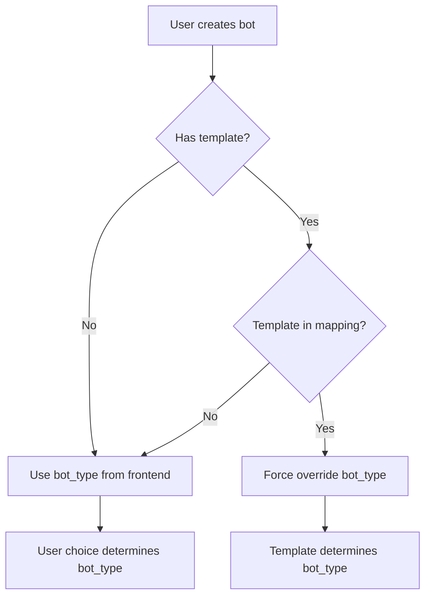

# 📋 Template → Bot Type Auto-Mapping

## 📊 Overview

Khi tạo bot từ template, hệ thống **tự động override** `bot_type` dựa trên template name, bất kể frontend pass giá trị gì.

## 🎯 Mapping Table

### ✅ Universal Templates (Multi-Exchange)

| Template Name | Auto bot_type | Description | Trade Execution |
|---------------|---------------|-------------|-----------------|
| `universal_futures_signals_bot` | `SIGNALS_FUTURES` | Signals-only futures bot | ❌ No |
| `universal_futures_bot` | `FUTURES` | Active futures trading | ✅ Yes |
| `universal_spot_bot` | `SPOT` | Active spot trading | ✅ Yes |

### ✅ Binance-Specific Templates

| Template Name | Auto bot_type | Description | Trade Execution |
|---------------|---------------|-------------|-----------------|
| `binance_futures_bot` | `FUTURES` | Binance futures trading | ✅ Yes |
| `binance_futures_rpa_bot` | `FUTURES_RPA` | Binance RPA automation | ✅ Yes |
| `binance_signals_bot` | `PASSIVE` | Legacy signals (Robot Framework) | ❌ No |

### ⚪ Other Templates (No Auto-Mapping)

| Template Name | bot_type | Description |
|---------------|----------|-------------|
| `simple_sma_bot` | User choice | Simple technical bot |
| `llm_trading_bot` | User choice (default: `LLM`) | LLM trading bot |
| `advanced_ml_bot` | User choice (default: `ML`) | ML trading bot |

## 🔧 Logic Flow



## 📝 Examples

### Example 1: Template with Mapping (Override)

**Request:**
```json
{
  "name": "My Bot",
  "template": "universal_futures_signals_bot",
  "bot_type": "LLM"  // ← Frontend value (IGNORED)
}
```

**Result:**
```json
{
  "name": "My Bot",
  "bot_type": "SIGNALS_FUTURES",  // ← OVERRIDDEN by template
  "code_path": "bot_files/universal_futures_signals_bot.py"
}
```

### Example 2: Template without Mapping (User Choice)

**Request:**
```json
{
  "name": "My ML Bot",
  "template": "advanced_ml_bot",
  "bot_type": "ML"  // ← User choice (KEPT)
}
```

**Result:**
```json
{
  "name": "My ML Bot",
  "bot_type": "ML",  // ← KEPT as is
  "code_path": "bot_files/advanced_ml_bot.py"
}
```

### Example 3: No Template (User Choice)

**Request:**
```json
{
  "name": "Custom Bot",
  "bot_type": "TECHNICAL"  // ← User choice (KEPT)
}
```

**Result:**
```json
{
  "name": "Custom Bot",
  "bot_type": "TECHNICAL",  // ← KEPT as is
  "code_path": "s3://..."  // ← Uploaded to S3
}
```

## ⚠️ Important Notes

### 1. **Template Name = Source of Truth**

Nếu template có trong mapping → `bot_type` được **force override**  
Không cần quan tâm frontend pass gì!

### 2. **Backward Compatibility**

Templates KHÔNG có trong mapping → Giữ nguyên behavior cũ (user choice)

### 3. **Why Force Override?**

- ✅ Đảm bảo bot template hoạt động đúng
- ✅ Tránh user chọn sai bot_type
- ✅ Task routing dựa trên bot_type phải chính xác

## 🔍 Implementation

**File:** `core/crud.py`  
**Function:** `create_bot()`

```python
TEMPLATE_BOT_TYPE_MAPPING = {
    # Universal templates
    'universal_futures_signals_bot': 'SIGNALS_FUTURES',
    'universal_futures_bot': 'FUTURES',
    'universal_spot_bot': 'SPOT',
    
    # Binance templates
    'binance_futures_bot': 'FUTURES',
    'binance_futures_rpa_bot': 'FUTURES_RPA',
    'binance_signals_bot': 'PASSIVE',
}

# Force override logic
bot_type = TEMPLATE_BOT_TYPE_MAPPING.get(template)
if bot_type:
    filtered_bot_dict['bot_type'] = bot_type  # Force override!
```

## ✅ Benefits

1. **Consistency:** Template luôn có đúng bot_type
2. **User-Friendly:** User không cần biết bot_type của từng template
3. **Safe:** Tránh mismatch giữa template code và bot_type
4. **Task Routing:** Đảm bảo task handler đúng

## 📌 Related Files

1. **`core/crud.py`** - Auto-mapping logic
2. **`core/models.py`** - BotType enum
3. **`core/schemas.py`** - BotType schema
4. **`core/tasks.py`** - Task routing based on bot_type
5. **`api/endpoints/bots.py`** - Bot creation endpoints

## 🎉 Summary

**Rule:** Template name trong mapping → **Always override bot_type**  
**Reason:** Template code defines behavior, bot_type must match  
**Result:** Reliable, consistent bot creation from templates  

---

**Created:** 2025-10-18  
**Version:** 1.0  
**Status:** ✅ Production Ready

