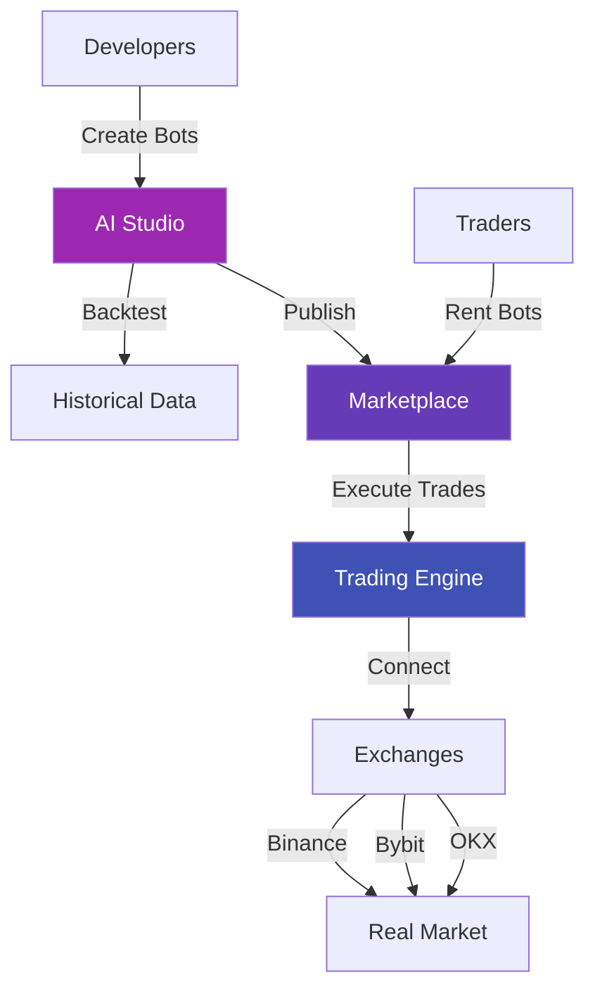

# QuantumForge Documentation

Welcome to **QuantumForge** - The AI-Powered Trading Bot Platform! 🚀

-   :rocket:{ .lg .middle } **Quick Start**

    ---

    Get started in 5 minutes with our step-by-step guide

    [:octicons-arrow-right-24: Getting Started](user-guide/01-getting-started.md)

-   :robot:{ .lg .middle } **Create Your First Bot**

    ---

    Build your first trading bot with AI integration

    [:octicons-arrow-right-24: Create Bot](user-guide/02-creating-your-first-bot.md)

-   :brain:{ .lg .middle } **LLM Integration**

    ---

    Add GPT-4, Claude, or Gemini to your bots

    [:octicons-arrow-right-24: LLM Guide](user-guide/04-llm-integration.md)

-   :chart_with_upwards_trend:{ .lg .middle } **Publish & Earn**

    ---

    Share your bot and earn passive income

    [:octicons-arrow-right-24: Marketplace](user-guide/07-publishing-to-marketplace.md)

---

## What is QuantumForge?

QuantumForge is a comprehensive platform for creating, testing, and deploying AI-powered trading bots.

### Two Main Components

=== "AI Studio"

    **For Developers & Bot Creators**

    - 🤖 Create intelligent trading bots
    - 🧠 Integrate AI/LLM (GPT, Claude, Gemini)
    - 📊 Backtest on historical data
    - 🔧 Visual bot builder (no coding)
    - 💰 Publish and monetize

    [Start Creating →](user-guide/02-creating-your-first-bot.md){ .md-button .md-button--primary }

=== "Marketplace"

    **For Traders**

    - 🏪 Browse verified trading bots
    - 📈 Compare performance metrics
    - 💳 Rent bots (ICP, PayPal, Credit Card)
    - 📱 Real-time monitoring
    - 🔄 Auto-renewal options

    [Browse Bots →](https://marketplace.quantumforge.ai){ .md-button }

---

## Key Features

### :material-robot: Intelligent Trading Bots

Create bots with:

- **Technical Analysis** - RSI, MACD, Bollinger Bands, etc.
- **Machine Learning** - Custom ML/DL models
- **AI-Powered** - GPT-4, Claude, Gemini integration
- **RPA Automation** - Browser-based trading

### :material-chart-line: Advanced Trading

- **Multi-Pair Trading** - Trade 2-5 pairs simultaneously
- **SPOT & FUTURES** - Support for both markets
- **Leverage Trading** - Up to 125x (use carefully!)
- **Risk Management** - Built-in stop loss, take profit

### :material-database: Robust Infrastructure

- **Exchanges**: Binance, Bybit, OKX, Bitget, Huobi
- **Blockchain**: Internet Computer (ICP)
- **Backend**: Python (FastAPI) + Celery
- **Frontend**: React + TypeScript

---

## Platform Architecture

---

## Quick Start Paths

### :beginner: For Beginners

!!! tip "Start Here"
    
    1. [Create Account](user-guide/01-getting-started.md#account-setup)
    2. [Add Exchange API Keys](user-guide/01-getting-started.md#exchange-api-keys)
    3. [Create First Bot](user-guide/02-creating-your-first-bot.md)
    4. [Test on Testnet](user-guide/01-getting-started.md#testnet-vs-mainnet)
    5. Go Live!

### :chart_with_upwards_trend: For Intermediate

!!! success "Level Up"
    
    1. [LLM Integration](user-guide/04-llm-integration.md)
    2. [Prompt Engineering](user-guide/05-prompt-engineering.md)
    3. [Multi-Pair Trading](user-guide/06-multi-pair-trading.md)
    4. [Risk Management](user-guide/08-risk-management.md)

### :rocket: For Advanced

!!! warning "Advanced Features"
    
    1. Custom ML Models
    2. RPA Browser Automation
    3. High-Frequency Trading
    4. [API Integration](API_REFERENCE.md)

---

## Popular Guides

-   **Bot Configuration**
    
    Learn all configuration parameters
    
    [:octicons-arrow-right-24: Read Guide](user-guide/03-bot-configuration.md)

-   **Risk Management**
    
    Protect your capital effectively
    
    [:octicons-arrow-right-24: Risk Guide](user-guide/08-risk-management.md)

-   **Backtesting**
    
    Test strategies before going live
    
    [:octicons-arrow-right-24: Backtest Guide](user-guide/09-backtesting.md)

-   **FAQ**
    
    Common questions answered
    
    [:octicons-arrow-right-24: View FAQ](user-guide/faq.md)

---

## Technology Stack

| Component | Technology |
|-----------|-----------|
| **Backend** | Python (FastAPI) |
| **Frontend** | React + TypeScript |
| **Blockchain** | Internet Computer (ICP) |
| **Database** | MySQL |
| **Task Queue** | Celery + Redis |
| **AI/LLM** | OpenAI, Anthropic, Gemini, Groq |
| **Exchanges** | Binance, Bybit, OKX, Bitget |

---

## Community & Support

-   :fontawesome-brands-discord:{ .lg .middle } **Discord**

    ---

    Join our community for real-time help

    [:octicons-arrow-right-24: Join Discord](https://discord.gg/quantumforge)

-   :fontawesome-brands-github:{ .lg .middle } **GitHub**

    ---

    Report bugs and request features

    [:octicons-arrow-right-24: GitHub Repo](https://github.com/quantumforge)

-   :material-email:{ .lg .middle } **Email Support**

    ---

    Get help from our support team

    [:octicons-arrow-right-24: support@quantumforge.ai](mailto:support@quantumforge.ai)

-   :material-twitter:{ .lg .middle } **Twitter**

    ---

    Follow for updates and announcements

    [:octicons-arrow-right-24: @quantumforge](https://twitter.com/quantumforge)

---

## Latest Updates

!!! info "Version 2.0 - October 2024"
    
    - ✨ Multi-pair trading support
    - 🤖 Enhanced LLM integration
    - 💳 PayPal payment support
    - 🔐 Improved security
    - 📊 Better analytics

[View Full Changelog →](FINAL_SYSTEM_STATUS.md){ .md-button }

---

## Ready to Start?

[Get Started →](user-guide/01-getting-started.md){ .md-button .md-button--primary }
[View API Docs →](API_REFERENCE.md){ .md-button }

---

**Built with :heart: by the QuantumForge Team**

[Privacy Policy](https://quantumforge.ai/privacy) · [Terms of Service](https://quantumforge.ai/terms) · [Contact Us](mailto:support@quantumforge.ai)

